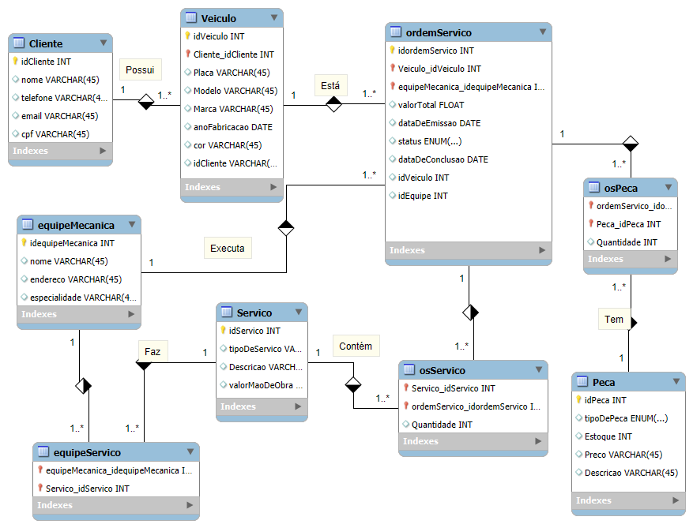

# Sistema de Controle e Gerenciamento de Ordens de Serviço para Oficina Mecânica

## 📌 Descrição do Projeto Descrição

Este projeto tem como objetivo desenvolver um sistema para controle e gerenciamento da execução de ordens de serviço em uma oficina mecânica. O sistema permitirá o registro de clientes, veículos, equipes de mecânicos, serviços realizados e peças utilizadas, facilitando o acompanhamento e a gestão eficiente das atividades da oficina.

## Narrativa 👇

- **Clientes** levam seus **veículos** à oficina mecânica para consertos ou revisões periódicas.
- Cada veículo é designado a uma **equipe de mecânicos**, que identifica os serviços a serem executados e preenche uma **Ordem de Serviço (OS)** com a data de entrega prevista.
- A partir da OS, calcula-se o valor de cada serviço, consultando uma tabela de referência de **mão de obra**.
- O valor de cada **peça** utilizada também compõe o valor total da OS.
- O cliente autoriza a execução dos serviços.
- A mesma equipe avalia e executa os serviços.
- Os mecânicos possuem código, nome, endereço e especialidade.
- Cada OS possui número, data de emissão, valor total, status e uma data para conclusão dos trabalhos.
- Uma OS pode ser composta por vários serviços, e um mesmo serviço pode estar contido em mais de uma OS.
- Uma OS pode ter várias peças, e uma peça pode estar presente em mais de uma OS.

## 🎯 Modelagem do Banco de Dados

A modelagem do banco de dados foi realizada utilizando o MySQL Workbench, considerando as seguintes entidades principais:

- **Cliente**: Armazena informações dos clientes da oficina.
- **Veículo**: Contém dados dos veículos atendidos, vinculados aos respectivos clientes.
- **EquipeMecanica**: Registra as equipes responsáveis pelos serviços.
- **Mecanico**: Detalha informações dos mecânicos, incluindo sua especialidade e vínculo com uma equipe.
- **OrdemDeServico (OS)**: Representa as ordens de serviço emitidas, com detalhes sobre os serviços e peças associados.
- **Servico**: Lista os tipos de serviços oferecidos pela oficina, com seus respectivos valores de mão de obra.
- **Peca**: Registra as peças utilizadas nos serviços, com suas descrições e preços.

## 🧩 Relacionamentos Entre Entidades

- **Cliente** 1:N **Veículo**: Um cliente pode possuir vários veículos.
- **Veículo** N:1 **EquipeMecanica**: Cada veículo é atendido por uma equipe específica.
- **EquipeMecanica** N:M **Servico**: As equipes podem executar diversos serviços, e cada serviço pode ser realizado por diferentes equipes.
- **Mecanico** N:1 **EquipeMecanica**: Cada mecânico pertence a uma equipe.
- **OrdemDeServico** N:M **Servico**: Uma OS pode incluir vários serviços, e um serviço pode constar em diversas OS.
- **OrdemDeServico** N:M **Peca**: Uma OS pode envolver várias peças, e uma peça pode ser utilizada em diversas OS.

## 🎯 Como Utilizar Este Repositório

1. Clone este repositório para sua máquina local.
2. Abra o arquivo do modelo no MySQL Workbench para visualizar e editar a modelagem do banco de dados.
3. Utilize os scripts SQL fornecidos para criar e popular as tabelas no seu banco de dados MySQL.

## Contribuições

Contribuições são bem-vindas! Se você tiver sugestões ou melhorias, sinta-se à vontade para abrir uma issue ou enviar um pull request.

